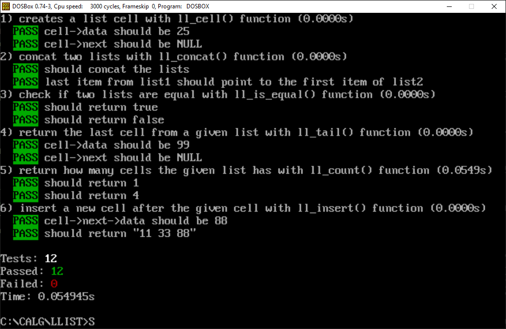

# MS-DOS: Algorithms and Data Structures

A collection of algorithms and data structures written in ANSI C compiled with Turbo C++ 3.0 (released in 1992) for MS-DOS (tested through DOSBOX).

## Tests

All examples have unit tests that are run by a simple test runner inspired by Jest.

You can run it by running the following commands:

```
make compile
tests.exe
```

`tests.exe` supports some cli arguments:
- `-i` interative mode
- `-l` outputs a log file with the results for all tests
- `-h` shows help

The tests output look like this:



## Data Structures

### Linked List
